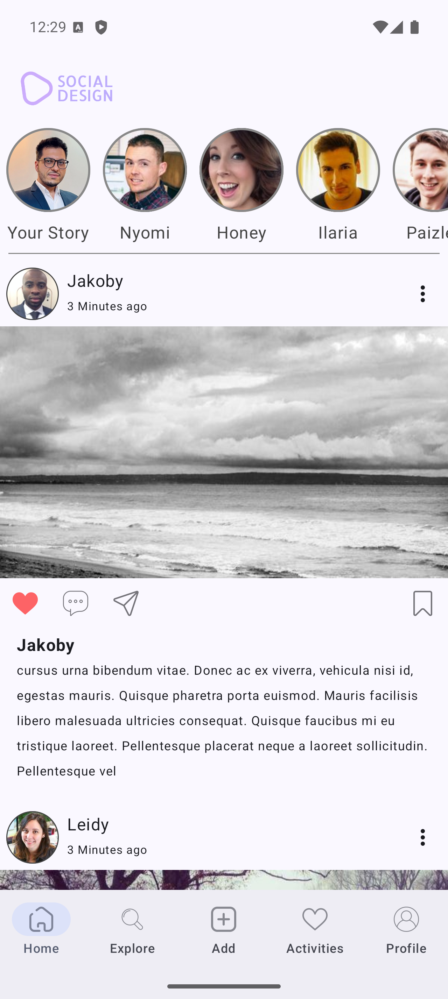
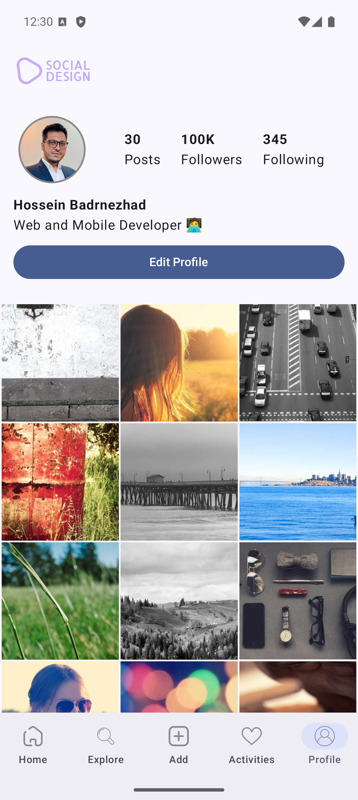
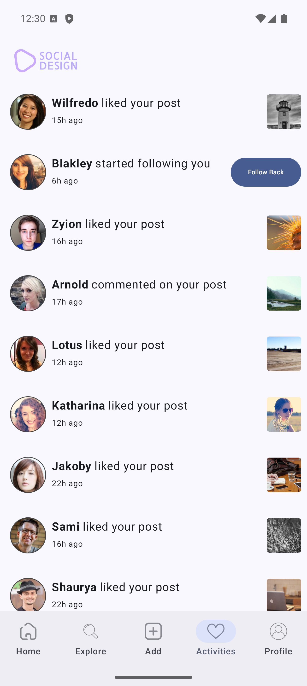

📸 Social Media App (Instagram Clone)

A social media application similar to Instagram built with Kotlin and Jetpack Compose.
This project demonstrates modern Android development practices with a focus on clean architecture, declarative UI, and Firebase integration.

---

🛠️ Tech Stack

- Kotlin

- Jetpack compose

- Navigation component

- Coil

---

📷 Screenshots

 

 
